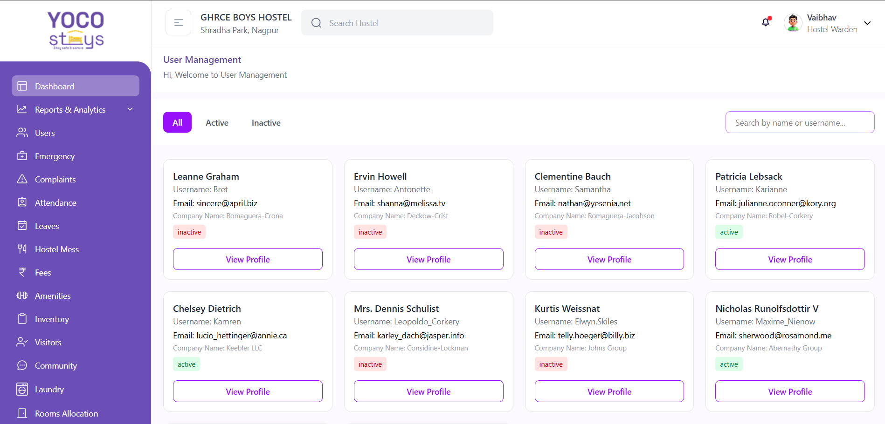
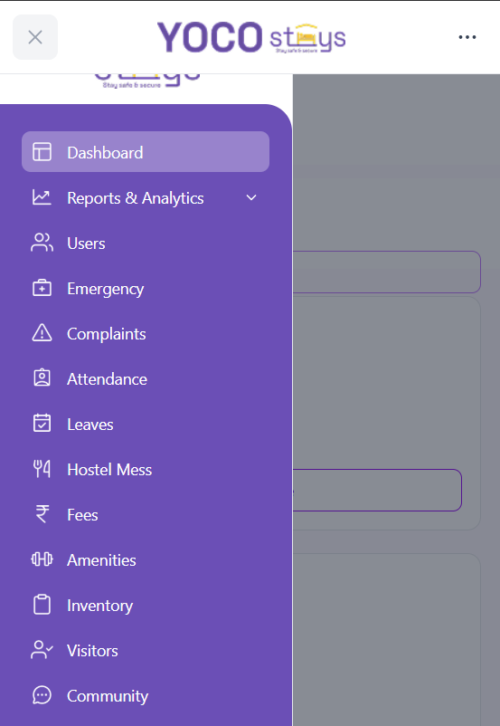
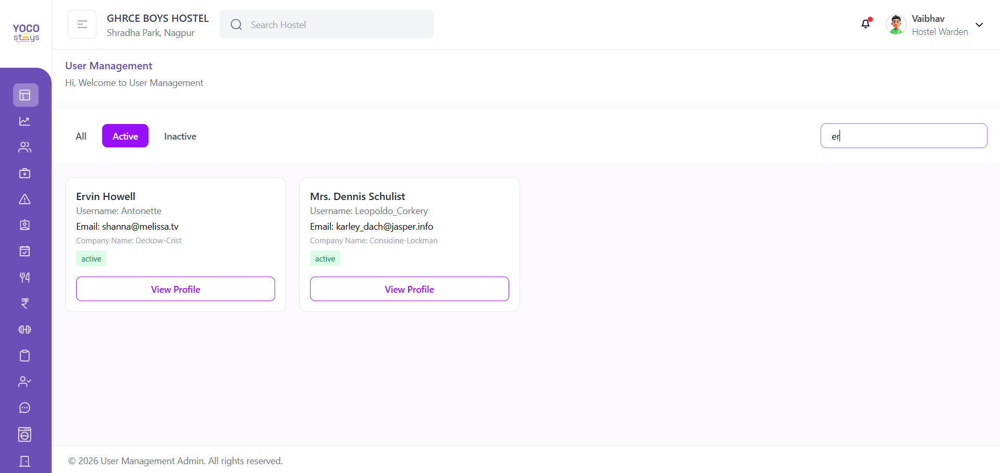

# User Management Admin Dashboard

A modern **Angular 21 Admin Dashboard** built with **standalone components**, **signals**, **RxJS**, and **Tailwind CSS**.  
This project focuses on clean UI/UX, responsive layout, and scalable architecture.

## Live Demo: user-management-admin-angular.vercel.app

📸 Screenshots
🖥 Desktop View – User List Page

Shows sidebar, filters, user cards, and layout

📷 (Add screenshot here)


📱 Mobile View – Responsive Layout


Shows mobile sidebar & stacked layout

📷 (Add screenshot here)


## ✨ Features

- 📊 **Dashboard Layout**
  - Collapsible sidebar (expand / minimize)
  - Responsive header, sidebar, content, footer
  - Mobile-friendly sidebar with backdrop

- 👥 **User Management**
  - Fetch users from API
  - Card/Grid layout display
  - Search users by name or username
  - Status filters: **All / Active / Inactive**
  - Randomly mocked user status (active/inactive)

- 👤 **User Profile**
  - Navigate to profile using dynamic route (`/profile/:id`)
  - Display full user details:
    - Basic info
    - Company details
    - Address & Geo location
  - Status badge passed via router state

- 🎯 **UX Enhancements**
  - Active menu highlighting
  - Loading & error states
  - Optimized rendering using Angular Signals
  - Smooth sidebar animations

---

## 🛠 Tech Stack

- **Angular 21**
- **Standalone Components**
- **Angular Signals**
- **RxJS**
- **Tailwind CSS**
- **Angular Router**
- **REST API Integration**

---

## 📁 Project Structure

```text
src/
├── app/
│   ├── pages/
│   │   ├── dashoard/
│   │   └── profile/
│   ├── shared/
│   │   ├── layout/
│   │   │   ├── header/
│   │   │   ├── sidebar/
│   │   │   ├── footer/
│   │   │   └── backdrop/
│   │   └── services/
│   │       ├── api.ts
│   │       └── sidebar.ts
│   ├── app.routes.ts
│   └── app.component.ts
└── assets/


Installation & Setup
1️⃣ Clone the repository
git clone https://github.com/your-username/user-management-admin.git
cd user-management-admin

2️⃣ Install dependencies
npm install

3️⃣ Run the application
ng serve

4️⃣ Open in browser
http://localhost:4200

🌐 API Used

This project uses the free public API:

https://jsonplaceholder.typicode.com/users


User status (active / inactive) is mocked locally for UI demonstration.

Developed with ❤️ using Angular and Tailwind CSS.
```
